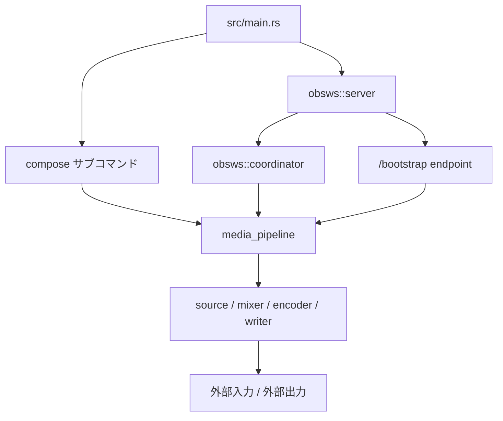
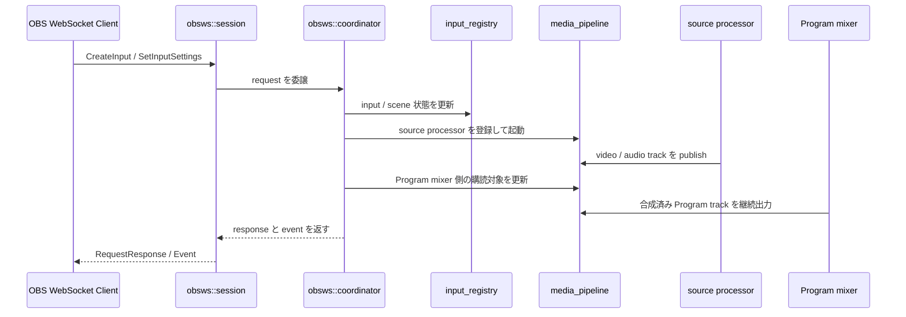

# Hisui 全体アーキテクチャ

この文書は、 Hisui の主要な内部構成を新規開発者向けに俯瞰するためのものです。

現在の Hisui は単一の用途だけに閉じた実装ではなく、共通のメディア処理基盤の上に複数の制御層を載せた構成になっています。
その中でも、ここでは `media_pipeline` と `obsws` を中心に説明します。

## この文書の対象範囲

- 主対象は `media_pipeline` と `obsws`
- `compose` は共通基盤の利用例としてのみ扱う
- `docs/obsws/` にあるプロトコル詳細や Request 単位の仕様は扱わない
- README に記載している将来構想の詳細設計は扱わない

## 全体像

Hisui の実装は、大まかには以下の 3 層に分かれます。

- エントリポイント層
  - `src/main.rs` で CLI サブコマンドを振り分ける
- 制御層
  - `obsws` のように外部 API やセッションを扱い、内部状態を調停する
  - `compose` のようにバッチ処理を組み立てる
- メディア処理基盤
  - `media_pipeline` が processor 登録、 track 公開、 subscribe、起動順制御を担う
  - 各 source / mixer / encoder / writer はこの基盤の上で動く

重要なのは、 `compose` や `obsws` がそれぞれ別個にメディア処理を完結させているわけではない点です。
実際の処理は共通基盤である `media_pipeline` の上に組み立てられます。

## 主要レイヤーの責務

### 1. エントリポイント層

`src/main.rs` は CLI の入口です。
ここではサブコマンドを判定し、各ユースケースごとの制御層に処理を渡します。

現時点では、以下のような役割分担になっています。

- `compose`
  - Sora 録画ファイルを入力として処理パイプラインを組み立てる
- `obsws`
  - 実験的な OBS WebSocket 互換サーバーを起動する
- `inspect` / `list-codecs` / `tune` / `vmaf`
  - 個別用途のサブコマンドとして独立している

### 2. `media_pipeline`

`src/media_pipeline.rs` は Hisui の共通メディア処理基盤です。
責務は「映像や音声をどう処理するか」そのものではなく、「processor 間をどう接続し、どう起動し、どう流すか」を管理することにあります。

`media_pipeline` 単体の仕組みについては、 [`media_pipeline` の仕組み](media_pipeline.md) を参照してください。

主な責務は以下です。

- processor の登録と解除
- track の publish / subscribe
- 初期 processor 群の ready 待ち合わせ
- processor 間 RPC sender の受け渡し
- 統計情報の共有
- local processor 用 runtime thread の管理

この設計により、個々の processor は「自分が入力を購読し、出力 track を公開する」という共通モデルで実装できます。
`media_pipeline` 自体は source、 mixer、 encoder の具体的な中身を知りません。

### 3. `obsws`

`obsws` は WebSocket セッションを受けるだけの薄い層ではありません。
OBS WebSocket 互換 API と内部状態、そして `media_pipeline` 上の実処理をつなぐ制御層です。

主な責務は以下です。

- `server`
  - TCP / TLS 待ち受け、 WebSocket handshake、 HTTP endpoint の提供
- `session`
  - 1 接続ごとのメッセージ解釈、 Identify、 Request / RequestBatch の入出力
- `coordinator`
  - Request を受けて内部状態を更新し、必要な processor の起動や停止を調停する
- `input_registry`
  - scene、 input、 output 設定、 state file 由来の状態を保持する
- `source`
  - input kind ごとの source processor 起動処理をまとめる

`session` は状態変更の本体を持たず、原則として `coordinator` に処理を委譲します。
この分離によって、通信セッションごとの処理と、アプリケーション全体の状態変更を分けています。

### 4. processor 群

実際にメディアを扱うのは、以下のような processor 群です。

- source
  - MP4、 RTMP、 SRT、 RTSP、 WebRTC、デバイス入力などを track に変換する
- mixer
  - 複数入力を Program 出力用の映像 / 音声に合成する
- encoder / decoder
  - コーデック変換を行う
- writer / publisher
  - MP4、 HLS、 DASH、 Sora などへ出力する

これらは独立したアルゴリズム実装ですが、起動と接続は `media_pipeline` 経由で統一されます。

## 代表的な処理フロー

### `obsws` 起動時の Program 出力初期化

`obsws::server::run_server()` は、 server 起動時に `MediaPipeline` を生成して起動します。
その後、現在の Program Scene から composed output plan を作り、常駐ミキサーを先に立ち上げます。

この時点で `obsws` は、以下を保持する状態に入ります。

- Program 出力用の固定 video / audio track
- Program 出力を生成する常駐 mixer processor
- scene / input の現在状態

この設計により、後から input を追加しても、出力全体の受け口は一定に保たれます。

### Input 作成から Program 出力反映まで

`obsws` で input を追加した場合の流れは以下です。

ここで重要なのは、 scene や input の論理状態と、 processor / track の実体を `coordinator` が橋渡ししている点です。
`session` は API の入口であり、メディアグラフの組み替え判断は `coordinator` 側に寄せています。

### `compose` の位置づけ

`compose` はバッチ処理用の制御層です。
Sora 録画ファイルを読み取り、レイアウトに応じて reader、 decoder、 mixer、 encoder、 writer を組み立てます。

ただし、構造上は `obsws` と同じく `media_pipeline` の利用者です。
そのため、 Hisui の全体アーキテクチャを理解する時に先に追うべきなのは `compose` 固有のロジックではなく、共通基盤である `media_pipeline` と、それをリアルタイム制御に接続する `obsws` 側です。

## 設計上の重要ポイント

### actor / handle ベースで制御する

`media_pipeline` も `obsws::coordinator` も、内部状態を 1 箇所に集約し、外部には handle や command channel を通して操作させる構成です。

これにより、以下を成立させやすくしています。

- 状態変更の入口を限定する
- 非同期処理でも責務境界を明確にする
- セッション単位の処理と全体状態を分離する

### Program 出力は固定し、入力側を差し替える

`obsws` では Program 出力の mixer を常駐させ、入力の増減に応じて source 側を組み替える設計を採っています。

このため、出力側の購読先や publisher を毎回作り直さずに済みます。
リアルタイム制御で重要な「出力の安定性」を優先した構成です。

### `input_registry` は API 状態の正本

scene、 input、 output 設定、 persistent data、 state file 復元結果などは `input_registry` に集約されます。

一方で、実際に流れている映像 / 音声の track や processor は `media_pipeline` 側にあります。
Hisui の `obsws` 実装では、この 2 つを分離して持ち、 `coordinator` が整合を取ります。

## どこから読むか

新規開発者がコードを追う時は、以下の順で読むと全体像を掴みやすくなります。

1. `src/main.rs`
   - サブコマンドの入口を確認する
2. `src/media_pipeline.rs`
   - 共通基盤の操作モデルを確認する
3. `src/obsws/server.rs`
   - server 起動時に何を初期化するかを確認する
4. `src/obsws/coordinator.rs`
   - API と内部処理の橋渡しを確認する
5. `src/obsws/session.rs`
   - 1 接続ごとの責務を確認する

より細かい仕様が必要な場合は、以下を参照してください。

- `docs/obsws/PROTOCOL_STATUS.md`
  - OBS WebSocket 互換機能の実装状況
- `docs/internals/media_pipeline.md`
  - `media_pipeline` の processor / publisher / subscriber、同期、 RPC の仕組み
- `docs/command_compose.md`
  - `compose` の利用方法と公開仕様
- `src/obsws/source/`
  - input kind ごとの source 実装

## まとめ

Hisui の全体像を短く言うと、 `media_pipeline` を共通基盤として持ち、その上に `obsws` や `compose` などの制御層を載せる構成です。

新しい機能を追加する時は、まず「これは API / 状態管理の変更なのか」「processor の追加なのか」「track 接続の変更なのか」を切り分けると、修正箇所を判断しやすくなります。
