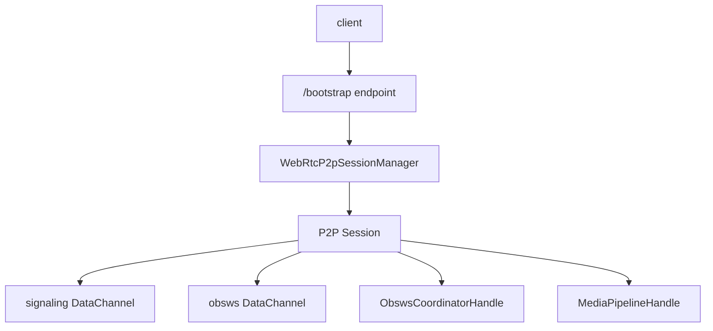
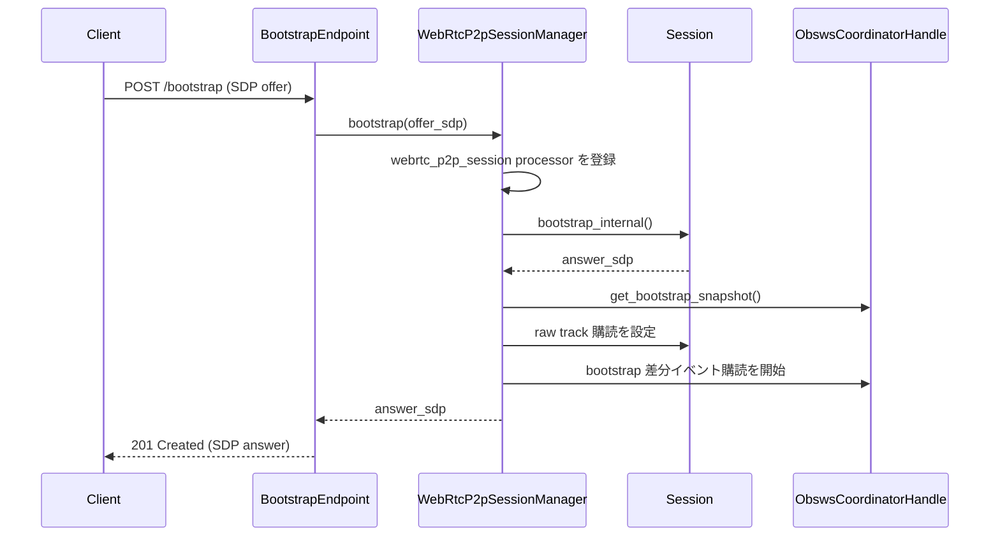
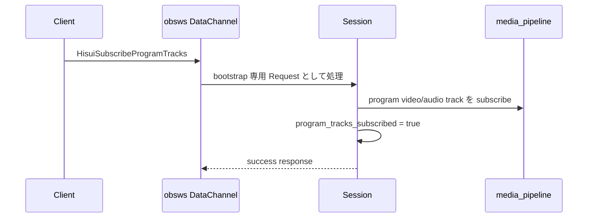

# `/bootstrap` の仕組み

この文書は、 Hisui の `/bootstrap` エンドポイントと、その背後で動く WebRTC P2P セッション管理の内部設計を新規開発者向けに説明するためのものです。

`/bootstrap` は単なる SDP 交換用の HTTP endpoint ではありません。
HTTP で最初の offer / answer を交換した後、 WebRTC 接続上の 2 本の DataChannel を使って、再ネゴシエーションと `obsws` 制御を継続する仕組みです。

## この文書の対象範囲

- `endpoint_http_bootstrap.rs`
- `webrtc/p2p_session.rs`
- `ObswsCoordinatorHandle` / `MediaPipelineHandle` との連携
- bootstrap 後の DataChannel 制御

以下は補助的に扱います。

- bootstrap 専用 `obsws` Request
- Program track 購読
- remote video track の attach / detach

以下は対象外です。

- WebRTC 一般論
- OBS WebSocket 全仕様
- 外部クライアント実装固有の UI や画面設計

## 全体モデル

`/bootstrap` の全体像は、 HTTP bootstrap、 P2P セッション、 DataChannel 制御の 3 層に分かれます。

重要なのは、 HTTP は入口にすぎない点です。
接続が確立した後の主役は `Session` であり、以後の制御は DataChannel を通じて行われます。

## 接続フェーズ

`/bootstrap` の接続は、大まかには以下の 3 フェーズで進みます。

### 1. Bootstrap フェーズ

クライアントは `POST /bootstrap` に `application/sdp` で SDP offer を送信します。
サーバーは answer SDP を `201 Created` で返します。

この時点では、まだ HTTP は最初の接続確立にしか使っていません。

### 2. WebRTC 接続確立フェーズ

answer を返した後、 PeerConnection の ICE / DTLS ハンドシェイクが進みます。
この過程でサーバー側は DataChannel を 2 本用意します。

- `label: "signaling"`
- `label: "obsdc"`

### 3. DataChannel 制御フェーズ

接続確立後は、以後の制御を DataChannel で行います。

- signaling DataChannel
  - 再ネゴシエーション
  - close 通知
- obsws DataChannel
  - `obsws` Request / Event
  - bootstrap 専用 Request

## 主要コンポーネントの責務

### `BootstrapEndpoint`

`endpoint_http_bootstrap.rs` の `BootstrapEndpoint` は HTTP 入口です。
主な責務は以下です。

- `POST /bootstrap` のみ受理する
- `Content-Type: application/sdp` を要求する
- body の SDP offer を `WebRtcP2pSessionManager` に渡す
- 成功時は answer SDP を返す
- 失敗時は `409 Conflict` や `500 Internal Server Error` を返す

この層は HTTP のバリデーションとレスポンス形成を担うだけで、セッション内部状態は持ちません。

### `WebRtcP2pSessionManager`

`WebRtcP2pSessionManager` は bootstrap のセッション生成と単一セッション制約を管理します。
主な責務は以下です。

- 同時に 1 セッションだけ許可する
- `MediaPipelineHandle` 上に `webrtc_p2p_session` processor を登録する
- `ObswsSession::new_identified()` を使って DataChannel 用 `obsws` session を作る
- `bootstrap_internal()` を呼んで `Session` を構築する
- 初期 snapshot 購読と差分イベント購読を開始する

`/bootstrap` が 1:1 接続であることを担保しているのはこの層です。

### `Session`

`Session` は接続中の実体です。
主な責務は以下です。

- PeerConnection と DataChannel の保持
- signaling / obsws メッセージの処理
- bootstrap snapshot に基づく raw track 購読
- Program track の購読 / 解除
- remote video track の保持と attach / detach
- `ObswsSession` を通じた `obsws` 制御

HTTP bootstrap が終わった後の本体はこの `Session` です。

## 起動時の流れ

HTTP bootstrap から `Session` 確立までは、概ね以下の流れです。

この流れで重要なのは以下です。

- answer SDP を返す前に `Session` を作る
- 返却後すぐに、 current input snapshot を元に raw track 購読を仕込む
- 以後の input 作成 / 削除に追随できるよう、 bootstrap 差分イベントも購読する

## DataChannel の役割分担

### signaling DataChannel

`signaling` DataChannel は再ネゴシエーション専用です。
ここで扱うのは、主に以下のメッセージです。

- offer
- answer
- close

つまり、接続のトポロジ変更や切断のための制御路です。

### obsws DataChannel

`obsws` DataChannel は、接続後の制御 API です。
ここでは以下を扱います。

- 通常の `obsws` Request / Response / Event
- bootstrap 専用 Request

この 2 本を分けることで、シグナリングとアプリケーション制御を混同しない構成にしています。

## `ObswsSession::new_identified()` を使う理由

bootstrap の `obsws` DataChannel では、通常の WebSocket handshake や `Identify` を行いません。
代わりに `ObswsSession::new_identified()` を使って、最初から Identify 済みの session を作ります。

この設計の意味は以下です。

- DataChannel 上では WebSocket の接続確立手順を繰り返さない
- すぐに `Request` を処理できる
- event subscription は bootstrap 用の前提に合わせて全購読状態で始められる

つまり bootstrap の `obsws` は、 transport だけを DataChannel に置き換えた軽量入口です。

## raw track と Program track

bootstrap 接続では、少なくとも 2 種類の購読対象があります。

### raw track

bootstrap 時に `coordinator` から取得した snapshot を元に、各 input の video / audio track を購読します。

これは input 単位の生トラックであり、 Program 合成前の流れです。

### Program track

Program track は初期状態では購読しません。
`HisuiSubscribeProgramTracks` が来た時だけ、 `program_track_ids` を使って購読します。

この設計により、クライアントは以下を切り替えられます。

- input ごとの raw track を受ける
- Program 出力だけを受ける
- 両方を受ける

## Program track 購読の流れ

Program track の購読 / 解除は概ね以下のように進みます。

解除時はこの逆で、 `HisuiUnsubscribeProgramTracks` により購読を解除し、 `program_tracks_subscribed` を false に戻します。

## remote video track の attach / detach

bootstrap 接続では、クライアントから送られてきた remote video track をサーバー側の `webrtc_source` input に接続できます。

この時の役割分担は以下です。

- `Session`
  - remote track を保持する
  - forward task を管理する
- `ObswsCoordinatorHandle`
  - input 名から対象 input を解決する
  - `webrtc_source` の `trackId` を更新する

つまり attach / detach は、 PeerConnection 側のトラック処理と、 `obsws` 側の論理状態更新をまたぐ操作です。

## `obsws` / `media_pipeline` との関係

`/bootstrap` は独立した機能ではなく、既存の `obsws` と `media_pipeline` に深く依存しています。

### `coordinator` から受けるもの

- bootstrap input snapshot
- bootstrap 差分イベント
- Program track ID
- `webrtc_source` 解決や `trackId` 更新 API

### `media_pipeline` から受けるもの

- track の subscribe
- track message の受信
- `webrtc_p2p_session` processor としての stats

つまり bootstrap は、「WebRTC 接続を張る層」であると同時に、「既存の `obsws` 状態と `media_pipeline` のメディア実体を外へ露出する層」でもあります。

## クライアントから見た期待動作

実装名に依存せずに言うと、 bootstrap クライアントは以下の前提で動く必要があります。

- 最初の接続確立は `POST /bootstrap` で行う
- 接続確立後は signaling DataChannel で再ネゴシエーションを受ける
- `obsws` DataChannel が open になってから Request を送る
- Program track は明示的に購読 Request を送った場合だけ受ける
- `HisuiGetWebRtcStats` は `Stats` 基盤ではなく、その時点の PeerConnection native stats を返す

この振る舞いを前提にすると、 HTTP 1 回と 2 本の DataChannel だけで接続後の制御を完結できます。

## どこから読むか

コードを追う時は、以下の順で読むと理解しやすいです。

1. `src/endpoint_http_bootstrap.rs`
   - HTTP 入口を見る
2. `src/webrtc/p2p_session.rs`
   - セッション全体の責務を見る
3. `src/obsws/coordinator.rs`
   - snapshot と差分イベントの供給元を見る
4. `src/obsws/session.rs`
   - DataChannel 上の `obsws` session の意味を見る

## 関連ドキュメント

- [全体アーキテクチャ](architecture_overview.md)
- [`obsws` の仕組み](obsws.md)
- [`stats` / メトリクスの仕組み](stats.md)
- [OBS WebSocket 互換機能 実装状況](../docs/obsws/PROTOCOL_STATUS.md)
