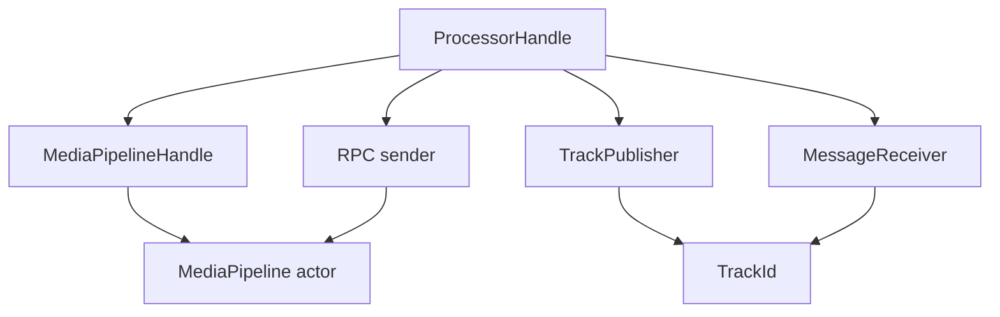

# `media_pipeline` の仕組み

この文書は、 `src/media_pipeline.rs` の設計を新規開発者向けに説明するためのものです。

`media_pipeline` は映像や音声の具体的なアルゴリズムを実装する場所ではありません。
processor 間の接続、起動順、同期、メッセージ配送、 processor 間 RPC の受け渡しを管理する共通基盤です。

## この文書の対象範囲

- `MediaPipeline` / `MediaPipelineHandle` / `ProcessorHandle`
- processor / publisher / subscriber / track の関係
- `publish_track()` / `subscribe_track()` / `notify_ready()` / `trigger_start()` / `wait_subscribers_ready()`
- `Message` / `Syn` / `Ack`
- processor 間 RPC sender の登録と取得

以下は対象外です。

- 各 source / mixer / encoder / writer のアルゴリズム詳細
- `obsws` や `compose` のユースケース固有の制御

## 全体モデル

`media_pipeline` は、 1 つの actor が内部状態を集約して持ち、各 processor は handle 経由でその actor を操作する構成です。

役割を短く言うと以下です。

- `MediaPipeline`
  - 内部状態の正本
  - command を受けて processor / track / RPC の状態を更新する
- `MediaPipelineHandle`
  - pipeline 全体を操作するための外部ハンドル
  - processor の spawn や RPC sender 解決を行う
- `ProcessorHandle`
  - 個々の processor が使う操作窓口
  - track の publish / subscribe や ready 通知を行う
- `TrackPublisher`
  - 1 つの track の publisher 側
  - subscriber へ `Message` を配信する
- `MessageReceiver`
  - subscriber 側の受信口
  - `Message` を順に受け取る

## 基本概念

### processor

processor は、 pipeline 上で動く処理単位です。
典型的には以下のどれかに該当します。

- source
  - 外部入力を track に流す
- mixer
  - 複数 track を受け取って合成結果を別 track に流す
- encoder / decoder
  - ある track を別形式に変換して新しい track に流す
- writer / publisher
  - track を受け取って外部出力へ流す

processor は `ProcessorId` で識別されます。
pipeline 側は processor の中身を知りません。
その processor がどの track を publish し、どの track を subscribe するかだけを管理します。

### track

track は、 processor 間でメディアや制御メッセージを流す論理的なチャネルです。
track 自体はデータを保持せず、 pipeline 内では以下の状態だけを持ちます。

- 現在の publisher が誰か
- publisher 不在時に待機している subscriber 群
- publish 中に追加された subscriber を publisher に転送するためのチャネル

### publisher

publisher は `TrackPublisher` です。
ある processor が `publish_track()` に成功すると、その track の publisher を 1 つだけ所有できます。

`TrackPublisher` の責務は以下です。

- subscriber へ `Message` を配信する
- publish 開始後に追加された subscriber を取り込む
- drop 時に subscriber を pipeline 側へ返却する

1 つの track に同時に複数の publisher は存在できません。

### subscriber

subscriber は `MessageReceiver` です。
processor が `subscribe_track()` を呼ぶと、 `MessageReceiver` を受け取ります。

subscriber の特徴は以下です。

- publisher がまだいなくても先に subscribe できる
- `Message::Media` / `Message::Eos` / `Message::Syn` を受け取る
- pipeline が途中終了した場合は `recv()` が `Message::Eos` を返す

publisher より先に subscriber が生成されることを前提に設計されています。

## ライフサイクル

### 1. processor の登録

processor は `MediaPipelineHandle::register_processor()` または `spawn_processor()` / `spawn_local_processor()` で登録されます。

登録時に確立されるものは以下です。

- `ProcessorId`
- `ProcessorMetadata`
- processor ごとの stats label
- error flag

`ProcessorHandle` が drop されると、 pipeline 側ではその processor が deregister されます。

### 2. track の subscribe

subscriber 側は `ProcessorHandle::subscribe_track()` を呼びます。

この時の振る舞いは以下です。

- track がまだ存在しなければ、 pipeline 側で空の track state を作る
- 初期 ready バリアが開いていなければ、 subscriber は `pending_subscribers` に積まれる
- バリア開放後で publisher が存在すれば、 publish 中の `TrackPublisher` へ転送される
- publisher がいなければ、次の publish を待つ

重要なのは、 subscribe は publisher の存在を前提にしていない点です。

### 3. track の publish

publisher 側は `ProcessorHandle::publish_track()` を呼びます。

publish 時の振る舞いは以下です。

- 既存 publisher がいれば失敗する
- `pending_subscribers` を引き取って `TrackPublisher` を作る
- 以後に追加される subscriber を受け取るための `new_subscriber_tx` / `new_subscriber_rx` を作る

これにより、 publish 前に待っていた subscriber と、 publish 後に追加された subscriber の両方を同じ `TrackPublisher` が扱えます。

### 4. ready 通知と初期開始

初期同期には `notify_ready()`、 `trigger_start()`、 `wait_subscribers_ready()` の 3 つが使われます。

- `notify_ready()`
  - その processor 自身の初期化完了を pipeline に通知する
- `trigger_start()`
  - これ以上「初期 processor」が増えないことを pipeline に通知する
- `wait_subscribers_ready()`
  - 初期 processor 全員の ready が揃うまで待機する

この 3 つは役割が異なります。
`notify_ready()` だけではバリアは開かず、 `trigger_start()` だけでも未 ready の processor が残っていれば進みません。

### 5. 初期 ready バリアの意味

pipeline は `trigger_start()` が呼ばれた時点で、その時までに登録済みの processor 群を「初期 processor 群」と見なします。

その後、以下の条件を満たした時に初期 ready バリアを開きます。

- 初期 processor 登録が閉じている
- 初期 processor 全員が `notify_ready()` 済みである

バリアが開くと、 `pending_subscribers` が publish 中の `TrackPublisher` に flush され、 `wait_subscribers_ready()` で待っていた processor が進めるようになります。

この仕組みの目的は、起動順のずれで最初のメッセージ配送が不安定になるのを防ぐことです。

### 6. unpublish と再 publish

`unpublish_track()` は track 自体の削除ではありません。
publisher 登録だけを外し、 subscriber は同じ track を待ち続けます。

つまり、次の publish が起きれば、既存 subscriber はそのまま再接続されます。

これは一時的な source 差し替えや再起動を扱いやすくするための設計です。

### 7. drop 時の扱い

`TrackPublisher` は drop 時に subscriber を pipeline 側へ返却します。
この返却により、 subscriber は「終了」ではなく「次の publisher を待つ」状態に戻れます。

一方、 `ProcessorHandle` が drop されると以下が起きます。

- processor 登録が解除される
- その processor が publish 中だった track は publisher 不在になる
- その processor の RPC sender 待機者には `ProcessorNotFound` が返る

## 同期の仕組み

### `pending_subscribers` と `new_subscriber_tx`

track には 2 種類の subscriber 待機場所があります。

- `pending_subscribers`
  - publisher 不在時、または初期 ready バリア開放前の subscriber
- `new_subscriber_tx`
  - publish 開始後に増えた subscriber を `TrackPublisher` へ渡す経路

この二段構えにより、 pipeline actor は subscriber の一覧を正本として持ちつつ、 publish 中の高速な配信は `TrackPublisher` 側に任せられます。

### `Syn` / `Ack`

`Message::Syn` はメディアデータではなく、メッセージグラフの末端まで到達したかを確認するための制御メッセージです。

publisher 側は `TrackPublisher::send_syn()` を呼ぶと `Ack` を受け取ります。
この `Ack` は、 `Syn` メッセージに内包されたチャネルの受信側が閉じた時に完了します。

意味としては以下です。

- subscriber が `Message::Syn` を受け取る
- その `Message::Syn` を保持している間は `Ack` は完了しない
- subscriber 側でそのメッセージが drop されると `Ack` が完了する

つまり `Syn/Ack` は、「送信した」という確認ではなく、「末端の受信処理がそのメッセージを手放した」ことの確認に使います。

### local processor 用 runtime

`spawn_local_processor()` は `Send` でない future を動かすための仕組みです。
pipeline は専用の current-thread runtime と `LocalSet` を別スレッドで保持し、 local processor のタスクをそこへ投げます。

これは WebRTC や OS API との都合で local task が必要な processor を扱うための補助機構です。

## 流れるメッセージ

track 上を流れる `Message` は 3 種類です。

| メッセージ | 用途 | 受信側での意味 |
| --- | --- | --- |
| `Message::Media` | 映像または音声フレームを運ぶ | 通常のメディア処理を進める |
| `Message::Eos` | End of Stream を示す | 入力終了として扱う |
| `Message::Syn` | 末端到達確認用の制御メッセージ | メッセージを保持している間、対応する `Ack` を完了させない |

`MessageReceiver::recv()` は、 pipeline が途中で落ちた場合も `Message::Eos` を返すため、利用側は「入力終了」として片付けやすくなっています。

## RPC の仕組み

`media_pipeline` には、 track とは別に processor 間 RPC sender を解決する仕組みがあります。

### 登録

processor 側は `ProcessorHandle::register_rpc_sender()` で、自分の RPC sender を pipeline に登録します。

登録できる sender は以下の条件を満たす必要があります。

- `Clone`
- `Send`
- `Sync`
- `'static`

pipeline 内では `ErasedRpcSender` として型消去して保持されます。

### 取得

別の processor や制御層は `MediaPipelineHandle::get_rpc_sender()` で、対象 processor の sender を取得します。

この API の重要な振る舞いは以下です。

- 対象 processor が未登録なら `ProcessorNotFound`
- 対象 processor が ready 前なら、その processor の結果が確定するまで待機する
- ready 後に sender が登録済みならそれを返す
- ready 後に sender 未登録なら `SenderNotRegistered`
- 要求型が登録型と異なれば `TypeMismatch`

つまり RPC sender は、「登録された瞬間」ではなく「その processor が ready になった時点」で外部から解決可能になります。

これは、 sender だけ先に見えて processor 本体がまだ初期化中、という中途半端な状態を避けるためです。

## 内部状態の見取り図

### `ProcessorState`

processor ごとに、 pipeline は以下のような状態を持ちます。

- `processor_type`
- `notified_ready`
- `is_initial_member`
- `subscribed_track_ids`
- `published_track_ids`
- `rpc_sender`
- `abort_handle`
- `pending_rpc_sender_waiters`

特に重要なのは以下です。

- `subscribed_track_ids`
  - 上流探索や依存関係把握に使う
- `published_track_ids`
  - deregister 時の cleanup に使う
- `pending_rpc_sender_waiters`
  - ready 前の `get_rpc_sender()` 呼び出しを待たせる

### `TrackState`

track ごとに、 pipeline は以下の状態を持ちます。

- `publisher_processor_id`
- `pending_subscribers`
- `new_subscriber_tx`

track state は軽量で、メディアデータそのものは保持しません。
あくまで「どこにつなぐか」を管理するための状態です。

### command channel と return channel

pipeline の中心は `MediaPipelineCommand` を受ける command channel です。
登録、 publish、 subscribe、 ready 通知、 RPC 解決などの状態変更はここを通ります。

一方、 `TrackPublisher` の drop 時に subscriber を戻す処理だけは `std::sync::mpsc` の return channel を使います。
これは `TrackPublisher` の drop が非 async であることと、 tokio mpsc の参照カウントに影響させたくないためです。

## どこから読むか

コードを追う時は、以下の順で読むと理解しやすいです。

1. `MediaPipeline::run()`
   - actor が何を管理しているかを見る
2. `handle_subscribe_track()` / `handle_publish_track()`
   - track 接続の実体を見る
3. `ProcessorHandle`
   - processor 側から見える操作面を確認する
4. `TrackPublisher` / `MessageReceiver`
   - 実際の配送と受信の振る舞いを見る
5. `media_pipeline.rs` のテスト
   - ready バリア、再 publish、 `Syn/Ack`、 RPC の意図を確認する

## 関連ドキュメント

- [全体アーキテクチャ](architecture_overview.md)
- [`mixer` の仕組み](mixer.md)
- [`timestamp` の仕組み](timestamp.md)
- [`stats` / メトリクスの仕組み](stats.md)
- `src/media_pipeline.rs`
