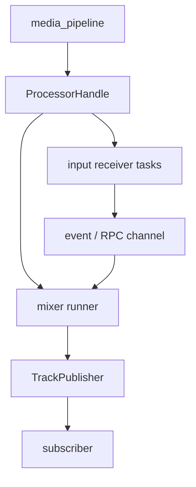
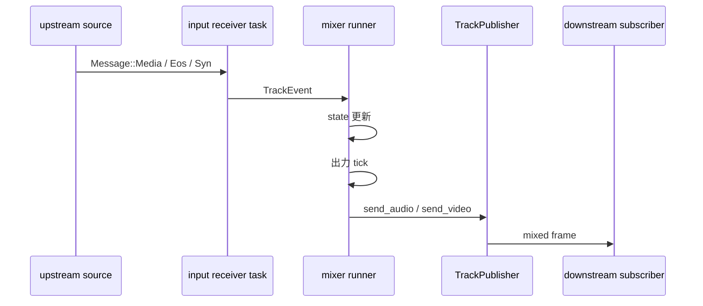

# `mixer` の仕組み

この文書は、 `src/mixer/audio.rs` と `src/mixer/video.rs` の realtime mixer を新規開発者向けに説明するためのものです。

Hisui の mixer は単なる描画処理や加算処理ではありません。
`media_pipeline` 上の processor として動き、複数入力を購読しながら、一定 cadence の出力 track を継続生成します。

## この文書の対象範囲

- `AudioRealtimeMixer`
- `VideoRealtimeMixer`
- 入力 track の購読と出力 track の publish
- input receiver task、 event channel、 RPC sender
- realtime の出力 cadence、 EOS、終了条件
- `stats` と `timestamp` 補助構造体との関係

以下は対象外です。

- `compose` 用の offline mixer アルゴリズム詳細
- レイアウト JSON の仕様
- `media_pipeline` 自体の command / RPC 設計

## 全体モデル

audio / video ともに、 mixer は同じ基本形で動きます。

起動時の共通手順は以下です。

1. 出力 track を `publish_track()` で確保する
2. 各入力 track を `subscribe_track()` する
3. 入力ごとに受信 task を起動し、 `Message` を mixer 内部 event に変換する
4. RPC sender を `register_rpc_sender()` で登録する
5. `notify_ready()` してから `wait_subscribers_ready()` で初期同期を待つ
6. runner ループに入り、 cadence に従って出力を継続する

`media_pipeline` 側の仕組みは、 [`media_pipeline` の仕組み](media_pipeline.md) を参照してください。

## 共通する設計パターン

### input receiver task

mixer 本体は各 input の `MessageReceiver` を直接 `select!` しません。
代わりに、入力 track ごとに task を立てて `TrackEvent` に変換し、中央の runner へ集約します。

これにより、 runner は以下だけを見ればよくなります。

- 入力から来た event
- mixer 固有の RPC
- 出力 tick

### `Message` の扱い

- `Message::Media`
  - audio mixer では `AudioFrame` を queue へ積む
  - video mixer では `VideoFrame` を pending frame に積む
- `Message::Eos`
  - 入力終了として state を閉じる
- `Message::Syn`
  - mixer 自身は passthrough せず、進行制御用として消費する

`Syn/Ack` の一般論は `media_pipeline` 文書にありますが、 mixer では特に video 側で重要です。

### RPC sender

audio / video ともに unbounded channel を RPC sender として登録します。
`obsws` などの上位制御層は、ここへ更新要求を送って mixer 構成を差し替えます。

## Video Realtime Mixer

### 役割

`VideoRealtimeMixer` は、複数 input を 1 枚の canvas に合成し、一定 frame rate で video frame を出力します。

主な責務は以下です。

- draw order に基づく重ね順管理
- crop / resize / scale 適用
- 現在時刻に応じた最新フレーム選択
- canvas サイズ、 frame rate、入力一覧の動的更新

### 時間の進め方

video mixer は `mixer_start` を基準に出力時刻を決めます。

- `next_output_instant()` で次に出すべきフレーム時刻を計算する
- その時点までに到着済みの input frame を `advance()` で current frame に反映する
- `compose_frame()` で現在の canvas を生成する

入力 frame 側は source timestamp をそのまま絶対時刻としては使いません。
初回入力 frame の timestamp と受信経過時間を使って、 realtime 出力向けの相対時刻へ補正します。

これは source 側の到着揺れを吸収しつつ、 mixer 自身の cadence を主導にするためです。

### `Syn/Ack` による進行制御

video mixer は、出力側が完全に詰まっても無限に先行しないように `Syn/Ack` を使います。

- 起動時に 1 回 `send_syn()` する
- 出力フレーム送信のたびに `noacked_sent` を増やす
- `MAX_NOACKED_COUNT` を超えたら、直前の `Ack` 完了を待つ
- 完了後に新しい `Syn` を送り直す

これにより、末端 subscriber が一定以上進んでいない状態で mixer が延々とフレームを積み上げるのを防ぎます。

### EOS の扱い

video mixer は低遅延を優先します。
入力 track が EOS になると、その input の未表示フレームは破棄し、 current frame も消してレイアウトから即座に外します。

つまり、 EOS 後に最後のフレームを保持し続ける設計ではありません。

### RPC 更新

video mixer の RPC は `UpdateConfig` と `Finish` です。

- `UpdateConfig`
  - canvas サイズ
  - frame rate
  - input track 一覧
  - 各 input の位置、サイズ、 crop、 scale
- `Finish`
  - mixer を終了フェーズへ移す

`UpdateConfig` では、削除された input の receiver を止め、新規 input を subscribe し直し、 draw order と stats を更新します。

## Audio Realtime Mixer

### 役割

`AudioRealtimeMixer` は、複数 input の音声を一定 frame duration ごとに合成して出力します。

主な責務は以下です。

- sample rate / channels の統一
- 入力 timestamp と sample 数を使った時間軸補正
- gap の無音補完
- 遅延入力の一部破棄
- mute / volume の適用
- 入力一覧の動的更新

### 時間の進め方

audio mixer は `tokio::time::interval(frame_duration)` を tick に使います。

各 tick で以下を行います。

1. その tick に対応する出力 timestamp を決める
2. 各 input queue から必要 sample 数だけ取り出す
3. mute / volume を考慮して加算合成する
4. 1 フレーム分の `AudioFrame` として出力する

video のように「現在表示する最新フレームを選ぶ」のではなく、 sample 単位の蓄積と排出で進みます。

### `SampleBasedTimestampAligner`

audio mixer の要点は、 `InputTrackState` が `SampleBasedTimestampAligner` を持つことです。

入力 frame 到着時は以下の順で処理します。

1. converter で sample rate / channels / format を統一する
2. 入力 timestamp と総出力 sample 数から、 aligner で安定 timestamp を求める
3. queue tail より未来なら無音を詰めて gap を埋める
4. queue tail より過去なら遅れた分を捨てる
5. sample queue に追加する

この設計により、入力 packet 間隔の揺れと decoder 内部 buffering の両方に耐えやすくしています。
詳細は、 [`timestamp` の仕組み](timestamp.md) を参照してください。

### EOS と終了条件

audio mixer は video より終了条件が明示的です。

- 各 input は EOS 状態を持つ
- queue が残っていれば、 EOS 済みでも出力は継続する
- `terminate_on_input_eos = true` の場合だけ、全入力が EOS かつ queue が空になった時点で終了できる
- `terminate_on_input_eos = false` の場合は、 EOS 済みでも終了しない

つまり、 audio mixer は「入力終了」 と 「processor 終了」 を分けています。

### RPC 更新

audio mixer の RPC は `UpdateInputs`、 `SetTrackMuteVolume`、 `Finish` です。

- `UpdateInputs`
  - 入力一覧の差し替え
- `SetTrackMuteVolume`
  - 特定 track の mute / volume 変更
- `Finish`
  - mixer を終了フェーズへ移す

入力追加時は新しい `InputTrackState` と receiver を作り、削除時は state と receiver を破棄します。

## audio / video の違い

| 観点 | video | audio |
| --- | --- | --- |
| 出力 cadence | frame rate | frame duration |
| 時間軸 | realtime の表示時刻基準 | sample 数基準 |
| backlog 制御 | `Syn/Ack` と `MAX_NOACKED_COUNT` | queue の gap 補完と late drop |
| EOS 時の扱い | 即時に現在フレームを外す | queue を吐き切るか設定で継続 |
| 動的更新 | layout / canvas 変更中心 | input 増減、 mute / volume 変更中心 |

両者は同じ `media_pipeline` 上の processor ですが、時間軸と終了条件の設計はかなり違います。

## 代表的な処理フロー

video の場合はこの間に `send_syn()` と `Ack` 待ちが入り、 audio の場合は input queue の gap 補完や late drop が入ります。

## stats の見方

audio / video ともに、 mixer は起動時に `handle.stats()` から processor 専用の metrics を取得します。

- video
  - 入力フレーム数
  - 出力フレーム数
  - 現在の canvas サイズ
  - 現在の frame rate
  - crop / resize をスキップした回数
- audio
  - 入力フレーム数
  - 出力フレーム数
  - 出力 duration
  - gap 補完 sample 数
  - late drop sample 数
  - timestamp rebase 回数

metrics 基盤自体は、 [`stats` / メトリクスの仕組み](stats.md) を参照してください。

## どこから読むか

1. `src/mixer/video.rs`
   - realtime video mixer の全体像と `Syn/Ack` を確認する
2. `src/mixer/audio.rs`
   - input queue と sample ベース時間軸を確認する
3. `src/timestamp/sample_aligner.rs`
   - audio mixer の時間補正を確認する
4. `tests/mixer_video_tests.rs`
   - 合成結果とレイアウト反映の期待値を見る
5. `tests/mixer_audio_tests.rs`
   - gap、 trim、混在期間の期待値を見る

## まとめ

Hisui の realtime mixer は、 「複数入力をまとめる processor」 であると同時に、 「一定 cadence の出力を維持する時間軸制御器」 でもあります。

不具合調査の時は、まず「入力の購読と state 更新の問題か」「出力 cadence の問題か」「audio / video 固有の時間軸補正の問題か」を切り分けると追いやすくなります。
