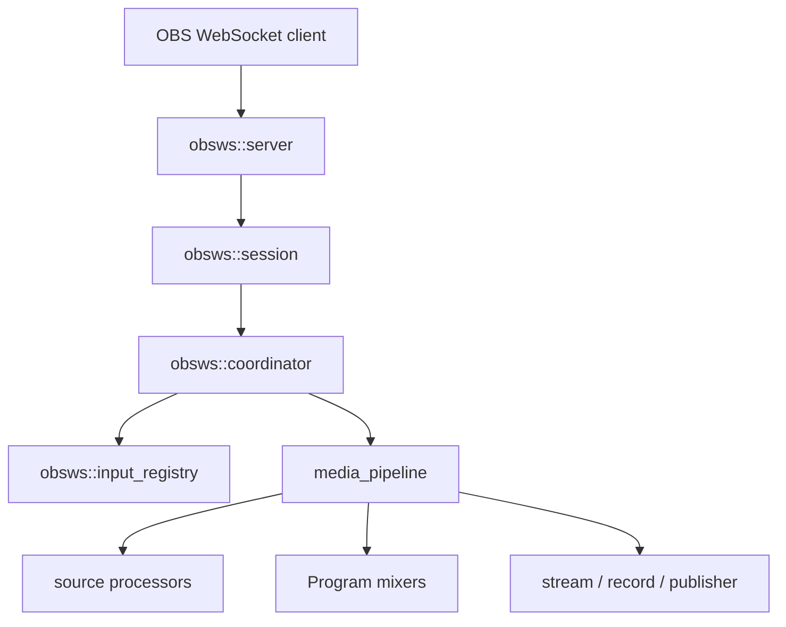
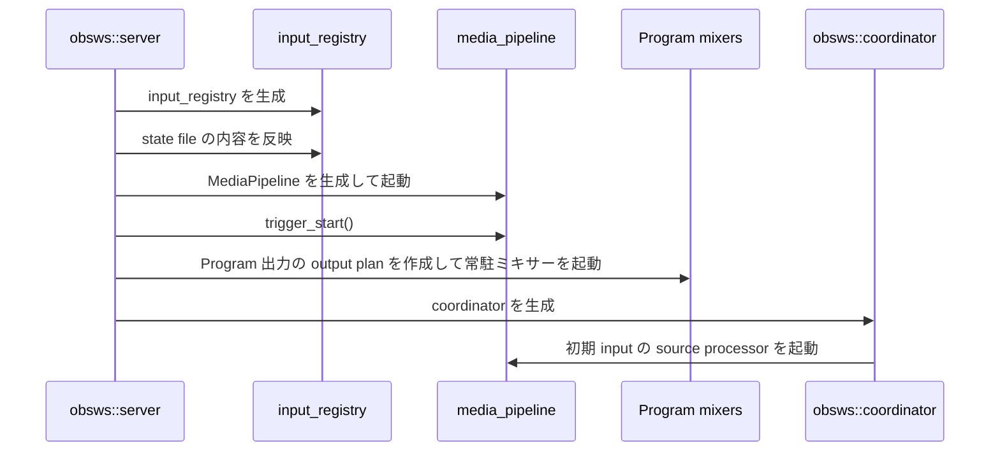
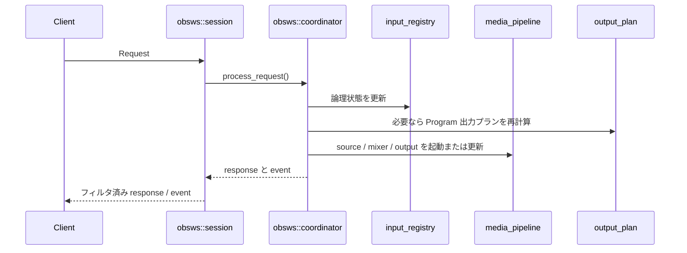

# `obsws` の仕組み

この文書は、 `src/obsws/` 周辺の内部設計を新規開発者向けに説明するためのものです。

`obsws` は単なる OBS WebSocket 互換 API の実装ではありません。
外部からの Request を受け取り、 `input_registry` 上の論理状態を更新し、必要に応じて `media_pipeline` 上の processor と track を組み替え、 response と event を返す制御層です。

## この文書の対象範囲

- `obsws::server`
- `obsws::session`
- `obsws::coordinator`
- `obsws::input_registry`
- `obsws::source`
- `obsws::output_plan`

以下は補助的に扱います。

- state file / persistent data
- `/bootstrap`

以下は対象外です。

- Request ごとの詳細仕様
- state file の完全なフォーマット定義
- 各 input kind ごとの source 実装詳細

## 全体モデル

`obsws` の内部構成は、外部接続、セッション処理、状態調停、状態保持、メディア実体の 5 層に分けて捉えると分かりやすいです。

重要なのは、 `obsws` が 1 つのモジュールで完結していない点です。
WebSocket の接続処理、 1 接続ごとのメッセージ解釈、アプリケーション全体の状態更新、メディア処理基盤への接続が明確に分離されています。

## 主要コンポーネントの責務

### `obsws::server`

`server` は外部入口です。
主な責務は以下です。

- TCP / TLS の待ち受け
- HTTP / WebSocket の振り分け
- `obswebsocket.json` subprotocol の取り扱い
- state file の読み込みと初期状態への反映
- `MediaPipeline` の起動
- Program 出力の常駐ミキサー初期化
- `ObswsCoordinator` actor の起動

`server` 自体は Request の意味を解釈しません。
起動時の初期化順序と、接続ごとの session 生成を担うモジュールです。

### `obsws::session`

`session` は 1 接続ごとの状態を持ちます。
主な責務は以下です。

- `Hello` / `Identify` / `Reidentify` の処理
- `Request` / `RequestBatch` の構文上の妥当性確認
- `ObswsSessionState` の管理
- event subscription による event のフィルタリング
- `SessionAction` への変換

`session` は、 API の入口ではありますが、 scene や input の状態本体は持ちません。
状態変更が必要な Request は基本的に `coordinator` に委譲します。

例外は `Sleep` のように、全体状態を変更せず session 単体で完結できる Request です。

### `obsws::coordinator`

`coordinator` は `obsws` の中心です。
主な責務は以下です。

- Request を処理して `input_registry` を更新する
- source processor の起動 / 停止を調停する
- Program 出力の再構築や同期を調停する
- response と event を組み立てる
- bootstrap 用 snapshot や補助的な問い合わせ API を提供する
- 致命的エラー時に server 側へ shutdown を通知する

`session` が「接続ごとの振る舞い」を持つのに対して、 `coordinator` は「アプリケーション全体の状態変更」を 1 箇所に集約しています。

### `obsws::input_registry`

`input_registry` は `obsws` の論理状態の正本です。
主な責務は以下です。

- scene / scene item / input の保持
- current program / preview scene の保持
- output 設定や runtime state の保持
- canvas サイズ、 frame rate、 record directory の保持
- state file 復元結果の反映先になる
- persistent data の保持

ここで持っているのは API から見える論理状態です。
実際にどの track が流れているか、どの processor が起動しているかは `media_pipeline` 側で管理されます。

### `obsws::source` と `obsws::output_plan`

`source` は input kind ごとの source processor 起動をまとめる層です。
各 input 設定から、どの processor をどう起動するかを `ObswsSourceRequest` として表現します。

`output_plan` は scene 上の input 配置から Program 出力の構成を作る層です。
主な責務は以下です。

- source plan の構築
- Program 用の固定 video / audio track の決定
- audio / video mixer processor ID の決定
- scene item の transform を mixer 入力へ変換する

`coordinator` は、状態変更の結果として必要になった source plan と output plan を使い、 `media_pipeline` 上の実体を組み立てます。

## 状態の分離

`obsws` を理解する上で重要なのは、状態が 1 箇所にまとまっていないことです。
意図的に分離されています。

### 接続状態

`session` ごとに以下の状態を持ちます。

- Identify 前か後か
- negotiated RPC version
- event subscription
- 接続単位の統計情報

これは接続ごとの一時状態であり、他 session と共有されません。

### 論理状態

`input_registry` が保持する状態です。

- scene
- input
- scene item
- output 設定
- record directory
- persistent data

これは `obsws` の API から見えるサーバー状態です。

### メディア処理の実体

`media_pipeline` 上に存在する状態です。

- source processor
- mixer processor
- publisher / writer
- track 接続

これは実際に映像や音声を流すための実体です。

### Program 出力の固定状態

`server` と `coordinator` は、 Program 出力用の固定 track と常駐ミキサーの状態を持ちます。

この設計により、 scene や input が変わっても、出力側の受け口を安定させやすくなります。

## 起動時の流れ

`obsws::server::run_server()` では、概ね以下の順序で初期化が進みます。

ここで重要なのは、 Program 出力が後付けではなく、 server 起動時に先に常駐ミキサーとして用意される点です。
`obsws` の各 Request は、その既存の Program 出力に対して入力側を差し替えたり、再構築したりする方向で動きます。

## Request から状態変更までの流れ

典型例として、 input 作成や input 設定変更のような Request は以下の流れで処理されます。

この流れのポイントは以下です。

- `session` は Request を解釈するが、状態変更本体は持たない
- `coordinator` が `input_registry` と `media_pipeline` の橋渡しをする
- response や event は `coordinator` で生成され、 session 側で購読条件に応じて絞り込まれる

## Program 出力の考え方

`obsws` では Program 出力を固定の video / audio track として扱います。
`output_plan` は現在の Program Scene から、その時点の source と mixer の構成を計算します。

この設計の利点は以下です。

- stream / record / publisher など出力側の接続先を安定させやすい
- scene や input の変更を「Program の再構成」として扱える
- source 側の起動や停止と、出力側の概念を分離しやすい

そのため `obsws` は、 scene を切り替えたり input を変更したりしても、常に同じ発想で Program 出力を作り直せます。

## response と event の扱い

`coordinator` は Request を処理した結果として以下を返します。

- response text
- 発火すべき event 一覧
- batch 用の結果

一方 `session` は、受け取った event を自分の `event_subscriptions` に応じてフィルタし、クライアントへ返します。

この分離により、以下が成立します。

- 状態変更ロジックと接続ごとの購読制御を分けられる
- 同じ状態変更結果を、 session ごとに異なる見え方で配信できる
- `coordinator` は「何が起きたか」を決め、 `session` は「その接続に何を見せるか」を決める

## state file と persistent data

state file と persistent data は、 `obsws` の主役ではありませんが、起動時と変更時の状態管理では重要です。

位置づけとしては以下です。

- 起動時
  - `server` が state file を読み、 `input_registry` の初期値へ反映する
- 実行中
  - `coordinator` が `input_registry` 上の変更結果を必要に応じて永続化する
- 再起動後
  - 再び `input_registry` の論理状態として復元される

詳細なフォーマットや realm の扱いは、既存のドキュメントを参照してください。

- [STATE_FILE.md](../obsws/STATE_FILE.md)
- [PERSISTENT_DATA.md](../obsws/PERSISTENT_DATA.md)

## `/bootstrap` の位置づけ

`/bootstrap` は WebSocket とは別の入口ですが、内部的には `obsws` の状態と密接に連携します。

`BootstrapEndpoint` は以下を受け取って初期化されます。

- `MediaPipelineHandle`
- `ObswsCoordinatorHandle`

つまり `/bootstrap` は独立したサブシステムではなく、 `obsws` が持つ Program 出力や input 情報を利用する補助入口です。
ただし、通常の OBS WebSocket Request 処理とは責務が異なるため、この文書では補助的にのみ扱います。

詳細は [`/bootstrap` の仕組み](bootstrap.md) を参照してください。

## どこから読むか

コードを追う時は、以下の順で読むと理解しやすいです。

1. `src/obsws/server.rs`
   - 起動順と初期化責務を見る
2. `src/obsws/coordinator.rs`
   - 状態調停の中心を見る
3. `src/obsws/session.rs`
   - 1 接続ごとの責務を見る
4. `src/obsws/input_registry.rs`
   - 論理状態の正本を見る
5. `src/obsws/source.rs` と `src/obsws/output_plan.rs`
   - 実体生成の橋渡しを見る

## 関連ドキュメント

- [全体アーキテクチャ](architecture_overview.md)
- [`media_pipeline` の仕組み](media_pipeline.md)
- [OBS WebSocket 互換機能 実装状況](../obsws/PROTOCOL_STATUS.md)
- [obsws State File](../obsws/STATE_FILE.md)
- [PersistentData](../obsws/PERSISTENT_DATA.md)
