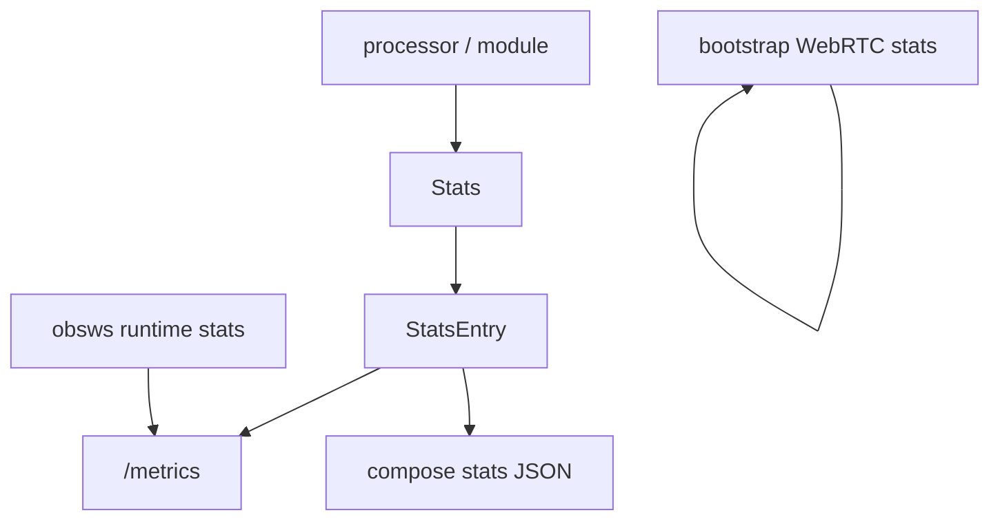
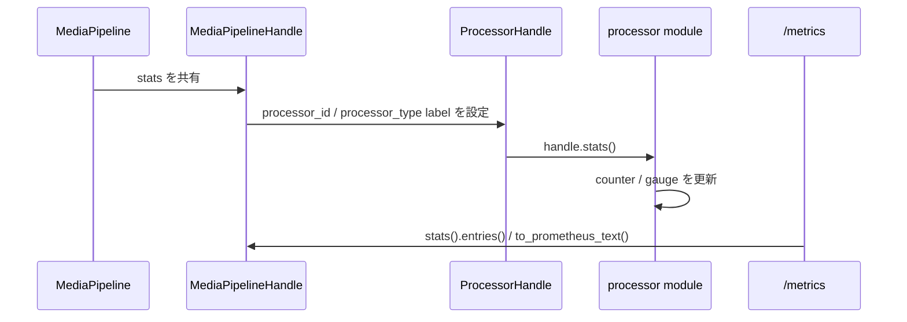

# `stats` / メトリクスの仕組み

この文書は、 Hisui の統計値基盤を新規開発者向けに説明するためのものです。

Hisui の統計値は、単なる補助情報ではありません。
processor ごとの実行状況、エラー状態、 runtime 状態を共通の仕組みで収集し、 `/metrics` や compose stats JSON などの複数の公開経路に流すための内部基盤です。

## この文書の対象範囲

- `src/stats.rs`
- `src/endpoint_http_metrics.rs`
- `MediaPipelineHandle::stats()`
- `ProcessorHandle::stats()`

以下は補助的に扱います。

- compose の `--stats-file`
- `obsws` の `GetStats`
- bootstrap WebRTC stats

以下は対象外です。

- 各 processor が定義している metric 名の完全一覧
- 外部 API ごとのレスポンス仕様の詳細

## 全体モデル

統計値の流れは、大まかには以下のように分かれます。

重要なのは、 Hisui の統計値が 1 種類の出力だけを前提にしていない点です。
共通基盤としては `Stats` があり、その上に Prometheus text、 Prometheus JSON、 compose 用 JSON などの整形層が載ります。

## 基本概念

### `Stats`

`Stats` は、 metric エントリ集合への共有ハンドルです。
内部的には以下を持ちます。

- `shared_entries`
  - metric 本体を保持する共有マップ
- `default_labels`
  - 今後取得する metric key に適用するラベル集合

`Stats` は clone できますが、 clone しても metric エントリ集合は共有されたままです。
一方で default label は clone 後に分岐できます。

### `StatsEntry`

`StatsEntry` は、出力や整形のために取り出した metric のスナップショットです。
以下を持ちます。

- `metric_name`
- `labels`
- `value`

`Stats::entries()` は、共有マップ上の現在値を `StatsEntry` の列へ変換して返します。

### `StatsLabels`

`StatsLabels` は label の集合です。
Prometheus 公開だけでなく、 compose stats JSON の processor 単位グルーピングにも使われます。

Hisui では特に以下の label が重要です。

- `processor_id`
- `processor_type`

### `StatsValue`

`StatsValue` は metric の型付き値です。
1 つの metric 名に対して型が固定され、別型で再取得すると panic になります。

## メトリクス型

Hisui の共通基盤では、以下の型が使えます。

| 型 | 用途 | Prometheus 上の見え方 |
| --- | --- | --- |
| `Counter` | 単調増加する回数 | `counter` |
| `Gauge` | 整数の現在値 | `gauge` |
| `GaugeF64` | 浮動小数の現在値 | `gauge` |
| `Duration` | 経過時間や累積処理時間 | `gauge` |
| `Flag` | 真偽値 | `gauge` (`0` / `1`) |
| `StringValue` | 文字列状態 | `gauge` (`1`) + `value` label |

ここで注意すべきなのは以下です。

- `Duration` は内部では `Duration` 型ですが、外部公開時は秒の数値になります
- `Flag` は Prometheus 上では `0` または `1` に変換されます
- `StringValue` は値そのものを数値としては出せないため、 `value` label に文字列を載せ、 metric 値は常に `1` になります

## ラベルモデル

### `set_default_label()` の意味

`Stats::set_default_label()` は、「これ以降に取得する metric key に付く default label」を更新します。

重要なのは、これは既存の metric エントリに遡及しないことです。
つまり、以下の順序には意味があります。

1. default label を設定する
2. `counter()` や `gauge()` で metric を取得する
3. その metric を更新する

逆に、すでに取得済みの metric に対して後から default label を変更しても、その metric の label は変わりません。

### clone 後の挙動

`Stats` を clone した後に片方で `set_default_label()` を呼ぶと、その clone の `default_labels` だけが差し替わります。
metric エントリ集合は共有されたままですが、「今後どの key を引くか」は分岐します。

この性質により、共通の統計基盤を使いつつ、 processor ごとに別 label を自然に付与できます。

### `processor_id` / `processor_type`

`media_pipeline` では、 processor 登録時に以下の default label が設定されます。

- `processor_id`
- `processor_type`

そのため processor 側で `handle.stats()` を通じて取った metric は、基本的に processor 単位で識別可能です。

## 収集の流れ

`Stats` の利用は `media_pipeline` 経由で広がることが多いです。

典型的な流れは以下です。

- `MediaPipeline` が共通の `Stats` を持つ
- `MediaPipelineHandle::stats()` がその clone を返す
- processor 登録時に `processor_id` / `processor_type` の default label が設定される
- 各 module が `counter()` / `gauge()` などを取得して更新する
- HTTP endpoint や用途別整形が `entries()` を読み出して公開する

## Prometheus 公開

Prometheus 公開は `src/endpoint_http_metrics.rs` が担います。

### `/metrics`

`GET /metrics` は Prometheus text format を返します。

ここで行っていることは以下です。

- `pipeline_handle.stats().to_prometheus_text()` で共通 metric を text 化する
- Tokio runtime metrics を追記する
- `text/plain; version=0.0.4` で返す

### `/metrics?format=json`

`GET /metrics?format=json` は Prometheus family 風の JSON を返します。

ここでは以下を行います。

- `Stats::entries()` で entry 一覧を取得する
- Tokio runtime metrics を entry として追加する
- `to_prometheus_json_families_from_entries()` で family 単位にまとめる

### metric 名と prefix

Prometheus 公開時には、すべての metric 名に `hisui_` prefix が付きます。

例えば `requests_total` は以下のように見えます。

- text: `hisui_requests_total`
- json: family 名 `hisui_requests_total`

### Tokio runtime metrics

Tokio runtime metrics は `Stats` 本体に格納されているわけではありません。
HTTP endpoint 側で現在 runtime から取得し、その場で追加しています。

現在追加される主な値は以下です。

- `tokio_num_workers`
- `tokio_num_alive_tasks`
- `tokio_global_queue_depth`

この点は、 processor 由来の metric と runtime 由来の metric を切り分けて考える上で重要です。

## 補助的な公開経路

### compose stats JSON

compose の `--stats-file` は、 `Stats::entries()` をそのまま外へ出すのではありません。
`sora/recording_compose_stats_json.rs` で processor 単位に再整形します。

この整形には以下の特徴があります。

- `processor_id` ごとにまとめる
- `processor_type` を `type` として出す
- `error` は特別扱いする
- `processor_id` / `processor_type` 以外の追加 label を持つ metric は除外する

つまり compose stats JSON は、 Prometheus 用の汎用表現ではなく、 compose 向けの互換 JSON です。

### `obsws` の `GetStats`

`obsws` の `GetStats` は `Stats` 基盤を一部参照しますが、レスポンス全体は `input_registry` の runtime state や output 状態を組み合わせた別集計です。

そのため、 `/metrics` をそのまま RequestResponse に変換しているわけではありません。

### bootstrap WebRTC stats

bootstrap DataChannel の `GetWebRtcStats` は、 `Stats` 基盤とは別物です。
WebRTC native stats を収集して JSON 化して返します。

これは「統計値の公開」という意味では近いですが、 `src/stats.rs` を通らない別経路です。

## 新しいメトリクスを追加する時の着眼点

### 1. 型を先に決める

その値が以下のどれかを最初に決めます。

- 累積回数
- 現在値
- 時間
- 真偽値
- 文字列状態

型を途中で変えると、同じ metric 名との整合が壊れます。

### 2. ラベルを安易に増やしすぎない

label は便利ですが、以下の影響があります。

- Prometheus 上の系列数が増える
- compose stats JSON では追加 label 付き metric が落とされる
- テスト側で参照条件が複雑になる

特に compose stats JSON に出したい値なら、 `processor_id` / `processor_type` 以外の label を付けない方が扱いやすいです。

### 3. 文字列 metric は特殊である

`StringValue` は Prometheus 上では数値として表現されません。
実質的には「状態文字列を label に出す」仕組みです。

そのため、以下を理解して使う必要があります。

- 集計対象の数値には向かない
- 現在の状態やフォーマット名の露出には向く
- compose stats JSON では文字列として自然に出せる

## どこから読むか

コードを追う時は、以下の順で読むと理解しやすいです。

1. `src/stats.rs`
   - 型とラベルモデルを見る
2. `src/endpoint_http_metrics.rs`
   - Prometheus 公開の形を見る
3. `src/media_pipeline.rs`
   - `Stats` が processor へどう伝播するかを見る
4. `src/sora/recording_compose_stats_json.rs`
   - 用途別整形の制約を見る

## 関連ドキュメント

- [全体アーキテクチャ](architecture_overview.md)
- [`media_pipeline` の仕組み](media_pipeline.md)
- [`obsws` の仕組み](obsws.md)
- [`/bootstrap` の仕組み](bootstrap.md)
