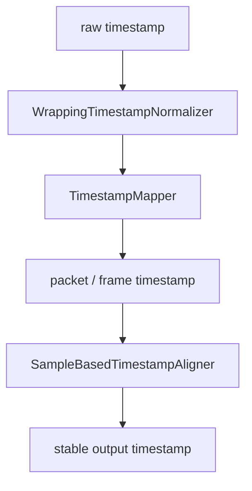
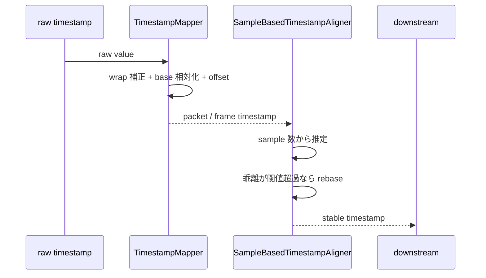

# `timestamp` の仕組み

この文書は、 `src/timestamp/mapper.rs` と `src/timestamp/sample_aligner.rs` の設計を新規開発者向けに説明するためのものです。

Hisui では、 timestamp は単に受け取った値をそのまま流すだけではありません。
入力プロトコルごとの生 timestamp を連続時間へ直し、必要に応じて sample 数ベースで安定化してから downstream に渡します。

## この文書の対象範囲

- `TimestampMapper`
- `WrappingTimestampNormalizer`
- `SampleBasedTimestampAligner`
- wrap 補正、基準化、 offset 加算、 rebase の考え方
- source / decoder / mixer での使い分け

以下は対象外です。

- 各 source 実装の個別 timestamp 仕様
- 各 codec の一般論
- `media_pipeline` 自体の同期やメッセージ配送

## 時間軸モデルの全体像

Hisui では、 timestamp 補正は大きく 2 段階あります。

- `TimestampMapper`
  - プロトコル由来の生 timestamp を `Duration` に変換する
- `SampleBasedTimestampAligner`
  - 主に音声 decode 後の timestamp を、出力 sample 数ベースで安定化する

前者は「外から来た時刻を連続時間へ直す」役割で、後者は「内部で生成された連続フレーム列に時刻を再割り当てする」役割です。

## `TimestampMapper`

`TimestampMapper` は、周回する整数 timestamp を `Duration` に変換する補助構造体です。

内部で行う処理は以下です。

1. bit 幅に応じて wrap を補正する
2. 初回入力を `base` として相対化する
3. `tick_hz` で tick 数を `Duration` に変換する
4. `offset` を足す

### `bits` / `tick_hz` / `offset` / `base`

- `bits`
  - 生 timestamp の bit 幅
  - 32 bit や 33 bit の wrap を判定するために使う
- `tick_hz`
  - 1 秒あたりの tick 数
  - 90 kHz や 1 kHz のようなプロトコル固有単位を `Duration` に直す
- `offset`
  - 変換後に足し込む固定オフセット
  - 複数入力の相対位置合わせに使える
- `base`
  - 初回入力の展開済み timestamp
  - これを 0 秒として以後を相対化する

重要なのは、 `TimestampMapper` が絶対時刻を保持するのではなく、初回入力基準の相対時間を作ることです。

## `WrappingTimestampNormalizer`

`WrappingTimestampNormalizer` は `TimestampMapper` の内部で使われます。
役割は、周回する生 timestamp を単調増加に近い整数列へ展開することです。

### wrap 判定

wrap 判定は `high-water mark` 方式です。

- 同一 epoch 内で見た最大の生 timestamp を保持する
- 新しい値がそれより小さく、差分が `half_modulus` を超えたら wrap とみなす
- 小さな逆行は wrap とみなさず、そのまま通す

この設計により、一時的な逆行や到着順の揺れで判定基準が下がるのを防いでいます。

### なぜ半周超えだけ wrap とみなすのか

小さな逆行は、到着順の揺れや source 側の時刻ぶれでも起こりえます。
それを wrap と誤判定すると、 timestamp が巨大に飛んでしまいます。

そのため、 「前回より小さい」だけでは足りず、 「半周を超える大きな差分がある」ことを wrap の条件にしています。

## `SampleBasedTimestampAligner`

`SampleBasedTimestampAligner` は、主に音声 decode 後の timestamp 安定化に使います。

AAC のように、入力 packet と出力 frame が 1 対 1 に対応しない形式では、入力 timestamp をそのまま出力へ引き継ぐと少しずつずれが溜まります。
そこで、以下の方針で timestamp を決めます。

- 最初の入力 timestamp を基準オフセットにする
- 以後は出力 sample 数の積算から timestamp を推定する
- 入力 timestamp と推定値の乖離が `rebase_threshold` を超えた時だけ基準を張り直す

### 何が安定するのか

通常時は sample 数ベースで timestamp が進むため、 decoder 内部の buffering や packet 分割の揺れに引きずられにくくなります。
一方で、入力側に欠落や大きな飛びがあれば、しきい値超過で rebase して現実の時刻に追従します。

### `TimestampMapper` との違い

- `TimestampMapper`
  - 生 timestamp の wrap と tick 単位を補正する
- `SampleBasedTimestampAligner`
  - decode 後の出力列を sample 数ベースで再整列する

両者は置き換え関係ではなく、段階の違う補正です。

## どの層で何を補正するか

- source 層
  - プロトコル固有の raw timestamp を受ける
  - 必要なら `TimestampMapper` で `Duration` に変換する
- decoder 層
  - packet と frame の対応が崩れる codec では、 decode 後の timestamp が不安定になりうる
- mixer 層
  - audio realtime mixer は `SampleBasedTimestampAligner` を使って入力 queue の時間軸を安定化する
  - video realtime mixer は sample 数ベースの aligner を使わず、受信時刻ベースの realtime 補正を持つ

つまり、 audio と video で補正方法は同じではありません。
音声は sample 数が時間軸の強い基準になり、映像は出力 cadence に合わせて現在フレームを選ぶ設計です。

## wrap と rebase の流れ

## 関連モジュールとの接続

- `src/mixer/audio.rs`
  - `InputTrackState` が `SampleBasedTimestampAligner` を持つ
  - 入力 frame 到着時に timestamp を queue へ積む前に補正する
- `src/mixer/video.rs`
  - source 側 timestamp をそのまま絶対基準にせず、 realtime の受信経過時間に寄せる補正を持つ
- 各 source / decoder
  - raw timestamp を `Duration` へ直す前段として `TimestampMapper` を使いうる

`mixer` 側の詳細は、 [`mixer` の仕組み](mixer.md) を参照してください。

## どこから読むか

1. `src/timestamp/mapper.rs`
   - wrap 補正と `Duration` 変換の基本モデルを確認する
2. `src/timestamp/sample_aligner.rs`
   - sample 数ベースの再整列を確認する
3. `src/mixer/audio.rs`
   - 実際に aligner が入力 queue 制御へどう接続されるかを見る
4. `src/mixer/video.rs`
   - audio と異なる realtime 補正の考え方を見る

## まとめ

Hisui の timestamp 補正は、 「raw timestamp を連続時間へ直す段階」 と 「内部の出力列を安定化する段階」 に分かれています。

不具合調査の時は、まず「生 timestamp の変換ミスなのか」「decode 後の再整列の問題なのか」「mixer 側の realtime 補正なのか」を切り分けると追いやすくなります。
